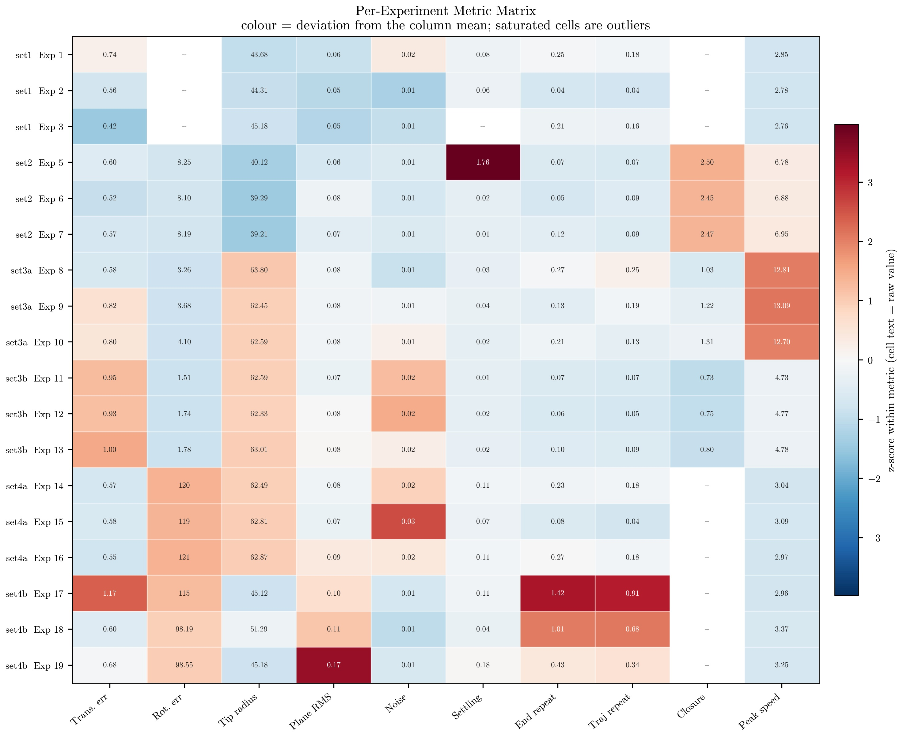
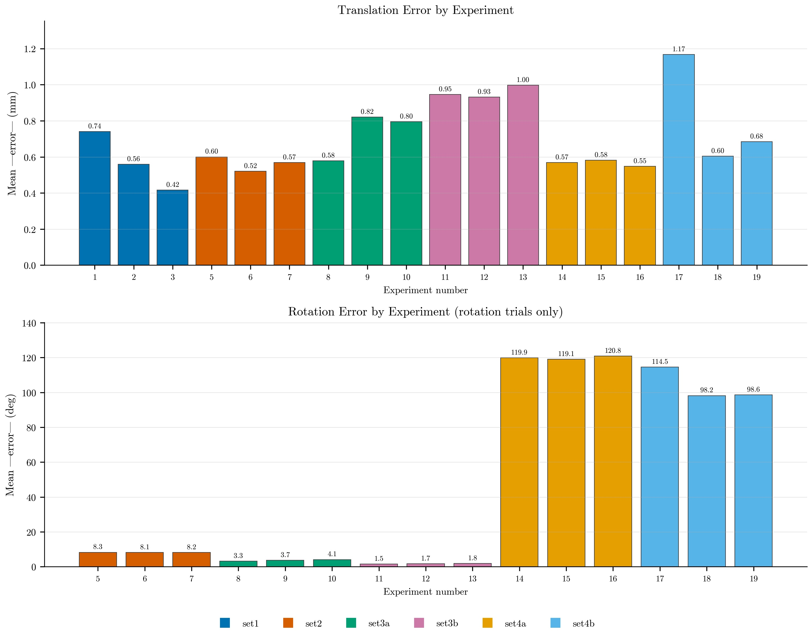
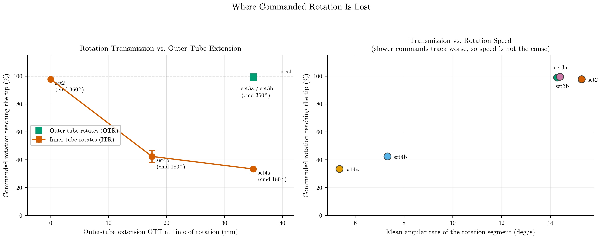
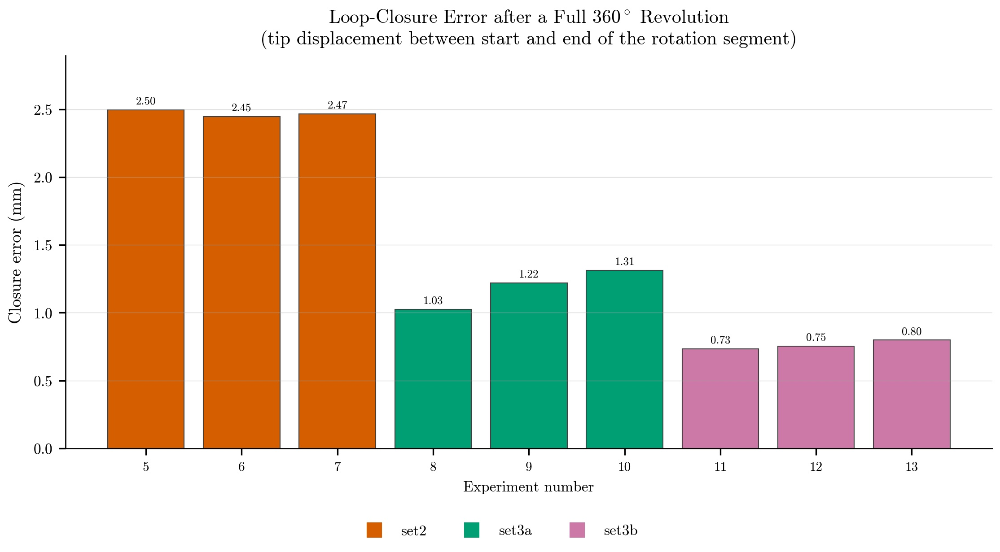
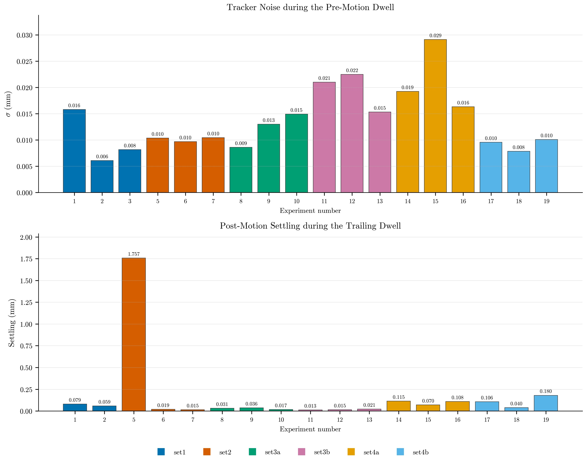
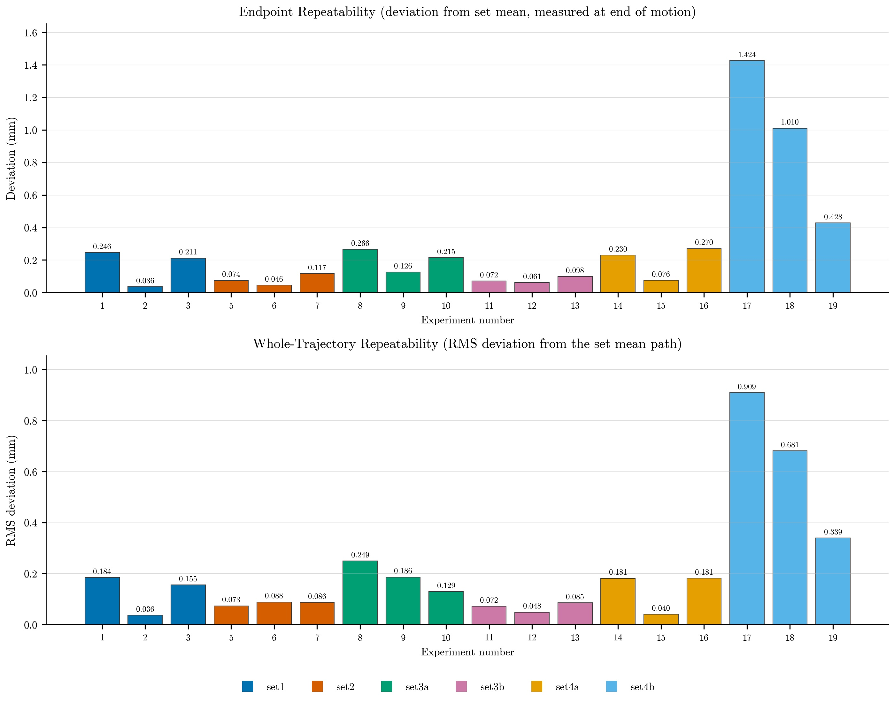
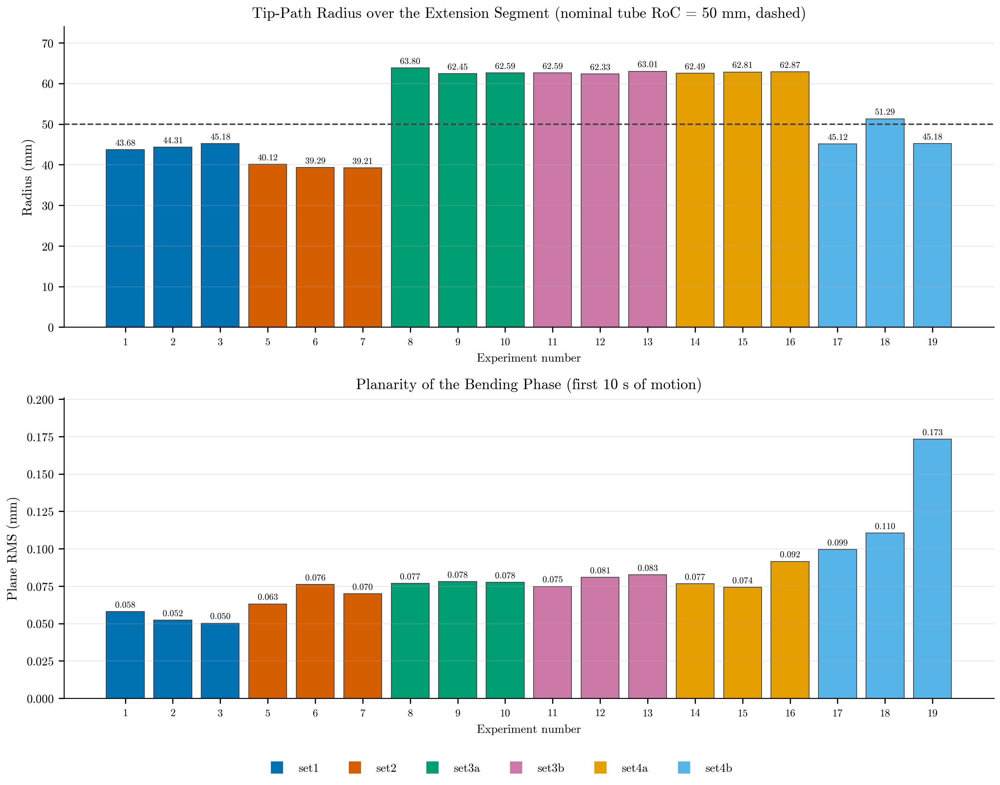
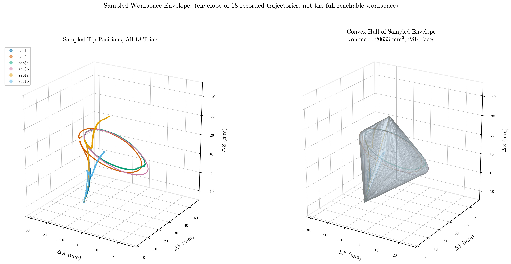
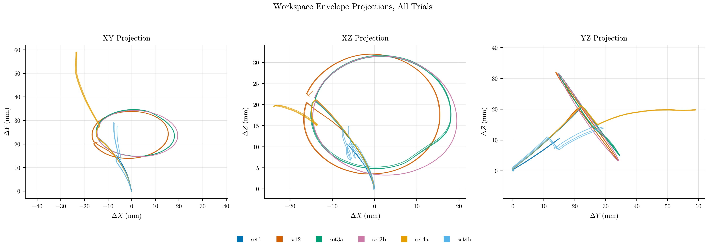
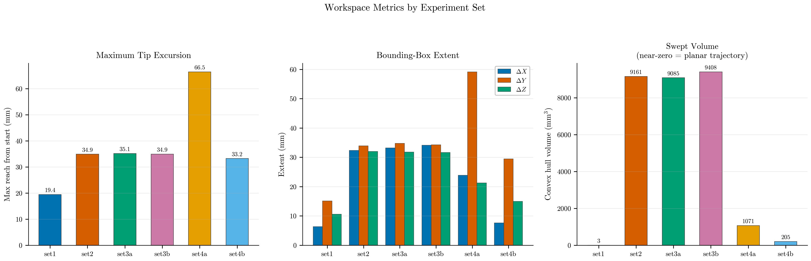

# Cross-Experiment Comparison and Workspace Analysis

**All 18 free-space trials compared trial-by-trial, plus workspace
characterisation and diagnostics**

ICRA 2027 · companion to [EVALUATION_REPORT.md](EVALUATION_REPORT.md) ·
code: [ndi_comparison.py](ndi_comparison.py) ·
data: [figures/comparison/comparison_metrics.csv](figures/comparison/comparison_metrics.csv)

---

## 1. What this adds

[EVALUATION_REPORT.md](EVALUATION_REPORT.md) reports each experiment *set* on
its own. This report compares all **18 individual trials** against one another,
characterises the sampled workspace, and adds diagnostics that were not
previously computed: tip-path curvature, loop-closure error, tracker noise,
post-motion settling, and whole-trajectory (rather than endpoint-only)
repeatability.

Two of these changed conclusions in the earlier report, and both corrections
have been applied there:

1. **The 180° rotation shortfall is not torsional windup.** It is inner/outer
   tube kinematic coupling — the loss scales with how far the *outer* tube is
   advanced (§3). This supersedes the earlier attribution.
2. **`set2` is not a poorly repeatable set.** Its 0.739 mm figure was an
   artifact of measuring at end-of-recording while the tip was still settling.
   Measured at end of motion it is 0.079 mm — the second best of six (§4).

### Method changes

Repeatability is now evaluated at the **end of the last commanded motion**
rather than at the end of the recording, and post-motion settling is reported
as its own metric instead of being folded into repeatability. Repeatability is
also computed over the **whole trajectory** — each trial is resampled to a
common arc-length parameterisation and compared against its set's mean path —
because endpoint agreement can hide mid-path divergence.

---

## 2. Per-experiment overview



*Every trial against every metric, coloured by z-score within each column
(cell text is the raw value). Saturated cells are outliers: Exp 5 settling,
Exp 17 repeatability, Exp 19 plane RMS.*



Three trials stand out and are discussed below: **Exp 5** (post-motion drift),
**Exp 17** (worst repeatability and translation error), and **Exp 19**
(worst planarity). No trial required exclusion.

---

## 3. Where commanded rotation is lost — the main result



The fraction of commanded rotation that actually reaches the tip depends almost
entirely on **which tube rotates and how far the outer tube is advanced**:

| Rotating tube | OTT at rotation | Commanded | Reaching the tip | Trials |
| :-- | --: | --: | --: | :-- |
| Inner (ITR), `set2`  | 0 mm    | 360° | **97.7 %** | 98, 98, 98 % |
| Inner (ITR), `set4b` | 17.5 mm | 180° | **42.4 %** | 36, 45, 45 % |
| Inner (ITR), `set4a` | 35 mm   | 180° | **33.4 %** | 33, 34, 33 % |
| Outer (OTR), `set3a` | 35 mm   | 360° | **99.0 %** | 99, 99, 99 % |
| Both (OTR+ITR), `set3b` | 35 mm | 360° | **99.5 %** | 100, 100, 100 % |

Inner-tube rotation is delivered essentially perfectly with the outer tube
retracted, then degrades monotonically as the outer tube is advanced. At the
same 35 mm extension where inner rotation delivers only 33 %, **outer** rotation
delivers 99 %. That asymmetry is the whole finding.

**Why this rules out torsional windup.** Windup subtracts a roughly *fixed*
angle. The 360° trials bound that constant at 2–8°, which cannot produce a 120°
shortfall on a 180° command. The loss is proportional and configuration-
dependent, not constant.

**Why it rules out a speed effect.** The poorly-tracked segments were commanded
*more slowly*, not faster: 5.4 deg/s (`set4a`, 33 %) and 7.3 deg/s (`set4b`,
42 %) against 14.3–15.3 deg/s for the sets that achieved 98–99 %. A dynamic lag
would show the opposite ordering.

**The likely mechanism** is concentric-tube curvature superposition: once the
stiffer outer tube overlaps the inner one, the resultant shape is dominated by
the outer tube, so reorienting the inner tube rotates the tip far less than
commanded. The outer tube, being dominant, transmits its own rotation in full.

**Confound to be aware of.** The OTT = 0 point was commanded 360° while the
other two inner-rotation points were commanded 180°, so command magnitude is
not perfectly separated from outer extension. The trend nonetheless holds
*within* the two 180° cases alone (42.4 % at 17.5 mm vs 33.4 % at 35 mm), where
the command is identical. **The clean experiment is ITR = 180° at OTT = 0** —
see §7.

### Independent corroboration: loop closure



After a full 360° revolution the tip should return to where the rotation began.
The residual gap is an independent measure of rotational fidelity that shares no
computation with the swept-angle metric, and it ranks the three configurations
**identically**:

| Set | Configuration | Rotation error | Loop closure |
| :-- | :-- | --: | --: |
| `set2`  | ITR only, outer retracted | 8.2° | 2.47 mm |
| `set3a` | OTR only                  | 3.7° | 1.19 mm |
| `set3b` | OTR + ITR together        | 1.7° | 0.76 mm |

Two unrelated measurements agreeing on the ordering is good evidence the ranking
is real. Rotating **both** tubes together is the most accurate mode.

---

## 4. Stability: noise, settling and drift



**Tracker noise** measured during the pre-motion dwell is **0.0138 ± 0.0059 mm**
(max 0.029 mm) — about 14 µm. Every mechanical effect discussed in these reports
is one to three orders of magnitude larger, so the NDI tracker is nowhere near
being the limiting factor.

**Post-motion settling** during the trailing dwell is **0.038 mm median**
(max 0.180 mm) across 17 of 18 trials — with one dramatic exception:

> **Exp 5 drifts 1.757 mm over a 10.6 s dwell after all motion has stopped**,
> monotonically and in one direction. That is 10–50× every other trial and
> ~130× the tracker noise. It is the single largest anomaly in the dataset.

Because that drift happens *after* the commanded motion, including it in
repeatability was charging mechanical creep to the robot's positioning
accuracy — which is what made `set2` appear to be the second-worst set when it
is in fact the second best.

The cause is not determinable from position data alone. Plausible candidates:
tube relaxation after the 360° rotation released stored torsion, a disturbance
to the field generator or the robot, or thermal drift in the tracker. Exp 5 is
also the trial logged in `exp_info.md` as having three videos, hinting at
operator activity around it. **Recommend re-running Exp 5** (§7).

---

## 5. Repeatability



| Set | Endpoint repeatability (mm) | Whole-trajectory RMS (mm) |
| :-- | --: | --: |
| `set3b` | 0.077 | 0.068 |
| `set2`  | 0.079 | 0.083 |
| `set1`  | 0.164 | 0.125 |
| `set4a` | 0.192 | 0.134 |
| `set3a` | 0.202 | 0.188 |
| `set4b` | **0.954** | **0.643** |
| **All** | 0.278 (max 1.425) | 0.207 (max 0.909) |

Five of six sets repeat to better than 0.21 mm. `set4b` is 5–12× worse than any
other set on both measures, driven by **Exp 17** (1.425 mm endpoint, 0.909 mm
trajectory RMS). `set4b` is also the set with the most erratic rotation
(36/45/45 %) and the largest tip-path radius scatter (±2.90 mm vs ±0.17–0.61 mm
elsewhere). Its three trials disagree with each other in every geometric metric,
so this is a genuinely unrepeatable configuration rather than one bad trial.

The consistent story for `set4b`: it is the shortest-stroke configuration
(17.5 mm), so a fixed mechanical uncertainty occupies a proportionally larger
share of the commanded motion.

---

## 6. Geometry and workspace

### Tip-path curvature



The tip-path radius over the extension segment is tightly repeatable within each
configuration but differs sharply *between* configurations:

| Configuration | Tip-path radius (mm) |
| :-- | --: |
| `set2` — inner tube only, OTT = 0, 35 mm stroke | 39.54 ± 0.41 |
| `set1` — both tubes, 20 mm stroke               | 44.39 ± 0.61 |
| `set4b` — both tubes, 17.5 mm stroke            | 47.20 ± 2.90 |
| `set3a`/`set3b`/`set4a` — both tubes, 35 mm stroke | 62.64–62.95 ± 0.17–0.61 |

Circle-fit residuals are ≤ 0.116 mm, and a noise-perturbation test puts the
radius uncertainty at 0.05–0.22 mm (0.08–0.56 %), so the ~23 mm spread between
configurations is far outside measurement error.

> **Do not read these as the tube's radius of curvature.** The nominal RoC is
> 50 mm and no configuration matches it. That is expected: the tip path during
> extension is an *emergent* property of both tubes' precurvature, their
> overlap, and the stroke length — not a direct reading of a single tube's
> shape. The same tube pair gives 44 mm over a 20 mm stroke and 63 mm over a
> 35 mm stroke. The value of this metric is comparative, and the arcs subtend
> only 19–50°, which is a short arc from which to infer an absolute radius.

**Planarity** during the bending phase is 0.050–0.173 mm RMS, at the tracker
noise floor. Exp 19 is the worst at 0.173 mm.

### Workspace







| Set | Max reach (mm) | Bounding box X × Y × Z (mm) | Convex hull volume (mm³) |
| :-- | --: | :-- | --: |
| `set1`  | 19.4 | 6.3 × 15.1 × 10.6  | 3 |
| `set2`  | 34.9 | 32.3 × 33.9 × 32.0 | 9 161 |
| `set3a` | 35.1 | 33.2 × 34.7 × 31.8 | 9 085 |
| `set3b` | 34.9 | 34.1 × 34.3 × 31.6 | 9 408 |
| `set4a` | **66.5** | 23.9 × 59.2 × 21.2 | 1 071 |
| `set4b` | 33.2 | 7.6 × 29.4 × 14.9  | 205 |
| **All** | 66.5 | 43.4 × 59.3 × 32.1 | **20 633** |

Only the three full-revolution sets sweep a genuine 3D volume (~9 100–9 400 mm³
each). The others trace near-planar curves, which is why their hull volumes
collapse toward zero — `set1` at 3 mm³ is a flat arc, not a small workspace.
Hull volume is therefore a *planarity* indicator here as much as a size one.

`set4a` achieves the largest reach (66.5 mm) because it is the only sequence
that extends twice (35 + 35 mm).

> **This is a sampled envelope, not the reachable workspace.** These 18
> trajectories follow six specific command sequences; they do not sample the
> 4-DoF joint space. The 20 633 mm³ figure is the volume enclosed by the paths
> actually recorded and is a lower bound on what the robot can reach. A true
> workspace study needs a joint-space sweep (§7).

---

## 7. What should be done better

### Experiment design

1. **Run ITR = 180° at OTT = 0.** This is the single most valuable missing
   experiment. It removes the one confound in §3 by separating command
   magnitude from outer-tube extension, and would confirm the coupling
   mechanism directly. Adding OTT = 8.75 mm and 26.25 mm would turn §3's
   three-point trend into a proper transmission curve.
2. **Sweep the joint space for a real workspace map.** A grid over
   (OTT, ITT, OTR, ITR) — even coarse, ~5 values per axis — would replace the
   sampled envelope with an actual reachable workspace.
3. **Re-run Exp 5** to establish whether the 1.76 mm post-motion drift is
   reproducible or a one-off disturbance. As it stands one anomalous trial
   distorts a set-level statistic.
4. **Increase repetitions from 3 to ≥ 5.** With n = 3, one outlier (Exp 17)
   dominates its set's statistics and standard deviations are unreliable.
5. **Standardise the dwell periods.** Trailing dwells range from 1.1 s to
   10.6 s, so trials are not equally settled when the "final" position is read.
   A fixed dwell of ≥ 10 s would make settling comparable and let it be
   subtracted consistently.
6. **Record the drilling experiments.** Three drilling tests are listed in
   `exp_info.md` with no corresponding CSV, so they cannot be analysed.

### Measurement

7. **Add a distal orientation sensor (6-DoF).** Every rotation figure here is
   inferred from tip *position* via a fitted circle. A 6-DoF sensor would
   measure tube rotation directly and settle the §3 mechanism conclusively
   instead of by inference.
8. **Log commanded joint values alongside tip position.** Commands are
   currently transcribed from a markdown table into the analysis script by hand.
   Logging actual encoder targets per timestamp would remove that
   transcription risk and allow true per-sample tracking error instead of
   per-segment endpoint error.
9. **Record a long static trial** (~5 min, no motion) to separate tracker drift
   from mechanical creep. The present noise estimate uses pre-motion dwells of
   only a few seconds.

### Analysis

10. **Move segment boundaries out of the analysis code.** Segments are inferred
    from a speed threshold and then matched to a hand-written command list. This
    works — all 18 trials segment correctly — but it is fragile: Exp 19's 0.9 s
    pause nearly merged two steps, and a 1.0 s threshold would have silently
    corrupted that trial. Logged command timestamps would remove the inference
    entirely.
11. **Report the tip-path radius against a kinematic model.** The measured
    39–63 mm range is currently descriptive only. Comparing it against a
    Webster-style concentric-tube model would turn it into a model-validation
    result.
12. **Quantify hysteresis directionally.** Loop closure (§3) mixes hysteresis
    with drift. Commanding +360° then −360° and comparing the outbound and
    return paths would isolate directional hysteresis.

---

## 8. Reproducing

```bash
python3 ndi_tip_analysis.py     # per-set figures  -> figures/<set>/
python3 ndi_comparison.py       # this report's figures -> figures/comparison/
```

`figures/comparison/comparison_metrics.csv` holds one row per trial with all 23
metrics used here. Both scripts expose their thresholds on the command line;
defaults are documented in each file's module docstring.
