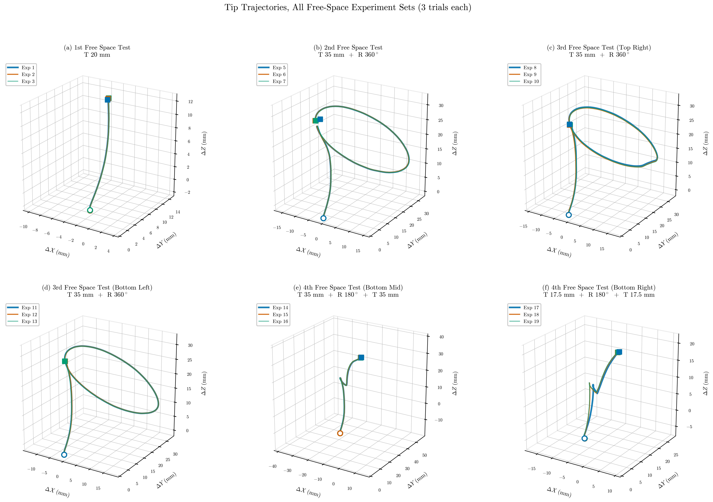
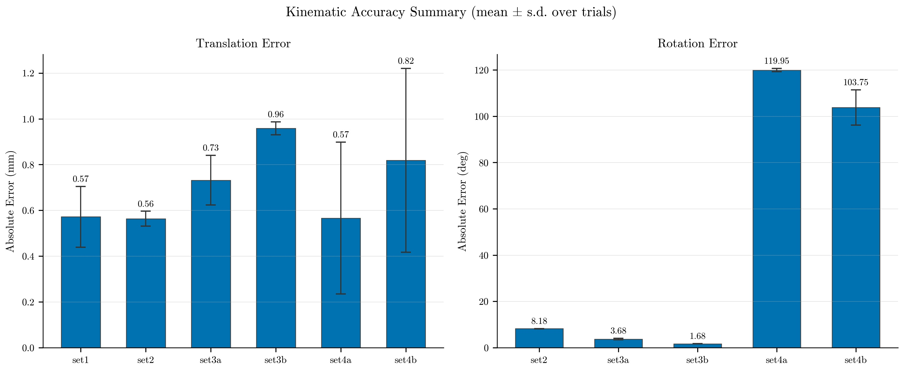

# Free-Space Evaluation of a 4-DoF Concentric Tube Robot

**Tip-tracking accuracy and repeatability from NDI electromagnetic measurements**

ICRA 2027 submission · experiment log: [exp_info.md](exp_info.md) · analysis code:
[ndi_tip_analysis.py](ndi_tip_analysis.py) · per-trial results:
[figures/kinematic_results.csv](figures/kinematic_results.csv)

---

## 1. Overview

We evaluated the open-loop accuracy and repeatability of a 4-DoF concentric tube
robot in free space. The four actuated degrees of freedom are outer/inner tube
translation (OTT, ITT) and outer/inner tube rotation (OTR, ITR); all curved
tube sections have a 50 mm radius of curvature.

Tip position was recorded with an NDI electromagnetic tracker at **60.0 Hz**
(uniform across all recordings). The dataset comprises **6 experiment sets × 3
repeated trials = 18 trials**, totalling **47 782 samples over 796 s** of
tracking.

| Set | Test | Commanded sequence |
| :-- | :-- | :-- |
| `set1`  | 1st Free Space Test              | T 20 mm |
| `set2`  | 2nd Free Space Test              | T 35 mm → R 360° (ITR only, outer tube fixed) |
| `set3a` | 3rd Free Space Test (Top Right)  | T 35 mm → R 360° (OTR only) |
| `set3b` | 3rd Free Space Test (Bottom Left)| T 35 mm → R 360° (OTR + ITR) |
| `set4a` | 4th Free Space Test (Bottom Mid) | T 35 mm → R 180° (ITR) → T 35 mm |
| `set4b` | 4th Free Space Test (Bottom Right)| T 17.5 mm → R 180° (ITR) → T 17.5 mm |

Exp 4 is excluded from all analysis (logged as "Random Exp — don't count").
Where a run was recorded twice, the aborted capture is skipped: `exp8_…225935`
is a 5.6 s abort with 0.05 mm of net motion, and `exp18_…010107` contains only
a CSV header. `exp17 … copy.csv` is byte-identical to `exp17.csv`.

---

## 2. Evaluation method

### 2.1 Data conditioning

Positions are converted to millimetres and referenced to each trial's first
sample, so every trace starts at the origin and trials are directly comparable.

Spike rejection is **discontinuity-based**: a sample is dropped only if it lies
more than 2 mm from *both* of its neighbours, which is the signature of a
tracker dropout. A magnitude-based filter (e.g. a median/MAD z-score on
absolute position) is inappropriate here — the tip legitimately travels tens of
millimetres, so such a filter flags the far end of a real trajectory as an
outlier and silently truncates the motion. Across all 18 trials **zero samples
were rejected**: the largest single-sample step in the dataset is 0.80 mm, so
the recordings contain no dropouts at all.

Positions are then smoothed with a 0.5 s centred moving average for all
derived quantities (speed, arc length, plane and circle fits). Raw samples are
retained for reporting sample counts.

### 2.2 Motion segmentation

Each trial contains commanded motion phases separated by operator pauses. We
compute a centred-difference speed profile (±0.3 s) and threshold it at
**0.3 mm/s**. This threshold is not delicate: the measured stationary noise
floor is 0.02–0.09 mm/s against 2.8–5.9 mm/s while moving, one to two orders of
magnitude apart.

The resulting binary mask is de-fragmented by discarding motion bursts shorter
than 1.0 s and pauses shorter than 0.8 s. With these settings the number of
detected motion segments matches the number of commanded steps for **all 18
trials**. The pause threshold matters: Exp 19 pauses for only ~0.9 s between
its first two steps, so thresholds of 1.0 s or above merge them into one
segment and corrupt that trial's measurements.

### 2.3 Planarity of the bending phase

A best-fit plane (SVD through the centroid) is fitted to the **first 10 s of
motion**, measured from motion onset rather than from the start of the
recording — several trials idle for 5–10 s before moving, and a window of pure
dwell yields a degenerate plane.

### 2.4 Translation metric

Translation of a segment is the tip's **path length** (arc length), not its
straight-line displacement: as a pre-curved tube is advanced, the tip travels
along the tube's own curve, so arc length is the quantity that corresponds to
the commanded advance at the base.

Arc length is accumulated on the smoothed path in ~0.2 s hops. Summing every
consecutive sample instead would integrate per-sample jitter into tens of
millimetres of phantom length over a minute-long record.

### 2.5 Rotation metric

Rotation of a segment is measured geometrically from the trajectory. We fit a
plane to the segment, project onto it, fit a circle algebraically (Kåsa), and
unwrap the angle about the circle centre; the swept angle is the measured
rotation. The circle radius and RMS fit residual are reported for every angle
so that a poor fit is visible rather than hidden behind a confident-looking
number.

---

## 3. Results

### 3.1 Tip trajectories



*Tip trajectories for all six experiment sets, 3 trials overlaid per panel
(line width tapered so coincident trials remain visible; ○ start, ■ end).
The 360° rotation sets (b–d) trace the expected closed cone; the 180° sets
(e, f) show a markedly smaller arc than commanded — see §3.5.*

### 3.2 Repeatability

Trial-to-trial agreement is sub-millimetre in every set. Final-position spread
about the per-set mean averages **0.391 mm** (worst case 1.445 mm):

| Set | Plane RMS, first 10 s (mm) | Plane RMS, full trajectory (mm) | 3D repeatability, mean (max) (mm) |
| :-- | --: | --: | --: |
| `set1`  | 0.053 | 0.06 | 0.165 (0.245) |
| `set2`  | 0.070 | 8.17 | 0.739 (1.108) |
| `set3a` | 0.077 | 7.66 | 0.214 (0.280) |
| `set3b` | 0.079 | 8.59 | 0.080 (0.099) |
| `set4a` | 0.081 | 0.96 | 0.187 (0.246) |
| `set4b` | 0.128 | 0.74 | 0.963 (1.445) |

The two plane-RMS columns quantify how strictly the *bending* phase is planar.
Over the first 10 s of motion the tip stays within **0.081 mm RMS** of a single
plane on average (worst trial 0.173 mm) — essentially at the tracker's noise
level. Over the full trajectory the residual rises to ~8 mm for the 360°
rotation sets, as expected: the rotation phase sweeps the tip out of the
initial bending plane. Set `set1` has no rotation phase and stays planar
throughout (0.06 mm).

### 3.3 Error table

Absolute error against the commanded value, aggregated over the 3 trials in
each set (mean ± s.d.; *n* is the number of measured segments).

| Set | Commanded sequence | Translation \|error\| (mm) | Rotation \|error\| (deg) | Rotation achieved |
| :-- | :-- | --: | --: | --: |
| `set1`  | T 20 mm                       | 0.57 ± 0.13 (n=3) | — | — |
| `set2`  | T 35 mm + R 360°              | 0.56 ± 0.03 (n=3) | 8.2 ± 0.1 (n=3) | 97.7 % |
| `set3a` | T 35 mm + R 360°              | 0.73 ± 0.11 (n=3) | 3.7 ± 0.3 (n=3) | 99.0 % |
| `set3b` | T 35 mm + R 360°              | 0.96 ± 0.03 (n=3) | 1.7 ± 0.1 (n=3) | 99.5 % |
| `set4a` | T 35 mm + R 180° + T 35 mm    | 0.57 ± 0.33 (n=6) | 120.0 ± 0.7 (n=3) | **33.4 %** |
| `set4b` | T 17.5 mm + R 180° + T 17.5 mm| 0.82 ± 0.40 (n=6) | 103.8 ± 7.6 (n=3) | **42.4 %** |
| **All** | | **0.70 (max 1.31), n=24** | **4.5 (360° sets) / 111.9 (180° sets)** | |



### 3.4 Translation accuracy

Translation is accurate to **0.70 mm mean absolute error** (worst single
segment 1.31 mm) against commands of 17.5–35 mm, i.e. **2.7 % of commanded
stroke on average** (range 0.5–7.5 %). In relative terms the shorter strokes
fare worst — 1.9 % mean at 35 mm versus 4.7 % at 17.5 mm — because the error is
roughly constant in absolute size rather than proportional to the command.

The error is **systematic, not random: all 24 of 24 translation segments
undershoot**, with a mean signed error of **−0.70 mm**. A consistent
one-sided bias of this kind points to an unmodelled compliance or a
transmission scale factor rather than to measurement noise, and it should be
correctable by calibration.

### 3.5 Rotation accuracy — a large discrepancy on the 180° steps

The 360° rotation sets track their command closely: **1.7–8.2°** mean absolute
error, i.e. 97.7–99.5 % of the commanded revolution. Accuracy is best when both
tubes rotate together (`set3b`, 1.7°) and worst when only the inner tube rotates
with the outer tube held fixed (`set2`, 8.2°).

The 180° inner-tube rotation steps behave very differently. The tip sweeps only
**59–82°** against a commanded 180°, achieving just **33–45 %** of the
commanded rotation — a mean absolute error of 111.9°:

| Set | Trial | Swept (deg) | Commanded (deg) | Achieved | Circle radius (mm) | Circle fit residual (mm) |
| :-- | :-- | --: | --: | --: | --: | --: |
| `set4a` | Exp 14 | 60.1 | 180 | 33 % | 7.85 | 0.039 |
| `set4a` | Exp 15 | 60.9 | 180 | 34 % | 7.79 | 0.036 |
| `set4a` | Exp 16 | 59.2 | 180 | 33 % | 8.08 | 0.035 |
| `set4b` | Exp 17 | 65.5 | 180 | 36 % | 3.26 | 0.016 |
| `set4b` | Exp 18 | 81.8 | 180 | 45 % | 3.70 | 0.036 |
| `set4b` | Exp 19 | 81.4 | 180 | 45 % | 3.71 | 0.037 |

**This is not a measurement artifact.** The circle-fit residuals for these
segments are **0.016–0.039 mm**, the lowest of any segment in the dataset — an
order of magnitude better than the 0.11–0.43 mm residuals of the 360° segments
that *do* match their command. The tip traces a very clean circular arc that
simply stops short. Were the shortfall a fitting or segmentation failure, the
residual would be large, not exceptionally small.

The behaviour is consistent with **torsional windup / stick-slip in the inner
tube**: rotation applied at the base is absorbed by torsion along the shaft
instead of being delivered to the tip. Two observations support this reading:

- `set4a` is tightly clustered at 33–34 % (s.d. 0.7°), whereas `set4b` spans
  36–45 % (s.d. 7.6°) — the largest trial-to-trial variability of any
  measurement in the study, which is characteristic of frictional stick-slip
  rather than a fixed scale error.
- The same actuator achieves 97.7–99.5 % on the 360° commands, so the shortfall
  is specific to the shorter 180° move, where a fixed windup angle consumes a
  proportionally larger share of the commanded rotation.

Note that `set4b` also shows the largest positional repeatability spread
(0.963 mm mean, 1.445 mm max) and the largest plane-fit residual (0.128 mm),
consistent with the same underlying mechanism.

---

## 4. Summary of findings

1. **Translation is accurate and highly repeatable** — 0.70 mm mean absolute
   error (2–4 % of stroke), with sub-millimetre trial-to-trial spread.
2. **Translation error is systematically one-sided** — 24/24 segments
   undershoot (mean −0.70 mm), indicating a calibratable bias rather than noise.
3. **The bending phase is essentially planar** — 0.081 mm RMS over the first
   10 s of motion, at the tracker's noise floor.
4. **Full-revolution rotation is accurate** — 1.7–8.2° error (97.7–99.5 % of
   command); best with both tubes co-rotating, worst with inner-only rotation.
5. **Half-revolution inner-tube rotation fails to reach the tip** — only
   33–45 % of the commanded 180° is delivered, with excellent circle-fit quality
   confirming the measurement. This is the dominant error source in the study
   and the clearest target for future work (torsional compensation or
   closed-loop tip feedback).

### Limitation

Commanded rotation is compared against the tip's swept angle about a fitted
circle, which is a geometric proxy for tube rotation and assumes the distal
section rotates rigidly about a fixed axis during the segment. The very low fit
residuals indicate the assumption holds well for these trajectories, but an
independent measurement of tube rotation (e.g. a distal orientation sensor)
would be needed to attribute the 180° shortfall to torsion conclusively. The
drilling experiments listed in `exp_info.md` have no corresponding CSV
recordings and are not covered here.

---

## 5. Reproducing this analysis

```bash
python3 ndi_tip_analysis.py                     # all sets -> figures/
python3 ndi_tip_analysis.py --sets set4a set4b  # selected sets
python3 ndi_tip_analysis.py --plane-window 5    # change plane-fit window
```

Per set, `figures/<set>/` contains `trajectory_3d.jpg`, `projection_xy.jpg`,
`projection_xz.jpg`, `plane_fit.jpg`, `position_vs_time.jpg`,
`position_vs_time_truncated.jpg`, `trajectory_3d_segments.jpg` and
`kinematic_error.jpg`. Top-level outputs are
`overview_trajectories_3d.jpg`, `summary_kinematic_error.jpg` and
`kinematic_results.csv` (39 rows, one per measured segment, including circle
radius, fit residual and segment start/end times).

Key parameters — `--speed-thresh` 0.3 mm/s, `--min-pause-s` 0.8 s,
`--smooth-s` 0.5 s, `--arc-step-s` 0.2 s, `--jump-mm` 2.0 mm,
`--plane-window` 10 s — are all exposed on the command line.
